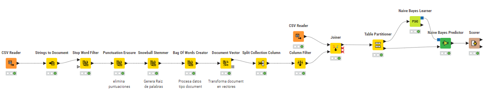
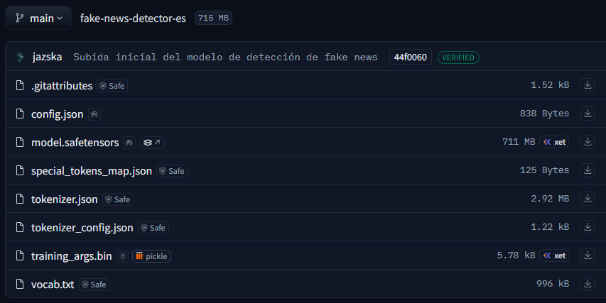

# Proyecto de Clase: Detección de Noticias Falsas con BERT y KNIME

## Descripción

Este proyecto busca resolver el problema de la **identificación automática de noticias falsas** en español, combinando enfoques clásicos de machine learning con modelos modernos de lenguaje (LLM). Se parte de un dataset real con textos noticiosos y se aplica un flujo de análisis que incluye preprocesamiento, vectorización, entrenamiento y evaluación de modelos.

---

## Objetivo

Desarrollar un sistema capaz de clasificar noticias como **verdaderas** o **falsas**, utilizando:

- Algoritmos tradicionales como **Naive Bayes** en KNIME
- Modelos de lenguaje como **BERT** en Google Colab con GPU

---

## Metodología

### 1. Gestión del proyecto

- Plan metodológico diseñado en **Notion** al igual que el s eguimiento de tareas

### 2. Obtención del dataset

- Dataset consolidado en CSV con columnas: `titulo`, `texto`, `clase`
- Fuentes: Kaggle, Internet y datos propios

### 3. Documentación técnica

- Repositorio en GitHub con:
  - Scripts de entrenamiento en Python
  - Flujos de trabajo en KNIME
  - Visualizaciones y métricas
  - Archivos `.md` explicativos

### 4. Análisis en KNIME

- Conversión a documentos
- Limpieza de texto (puntuación, stemming)
- Vectorización con Bag of Words
- Entrenamiento con Naive Bayes
- Evaluación con `Scorer`
**Flujo de procesamiento en KNIME**
Este flujo incluye lectura del dataset, preprocesamiento de texto, vectorización y entrenamiento con Naive Bayes.

**Resultados:**
- Accuracy: `42.7 %`
- Error: `57.3 %`
- Cohen’s Kappa: `0.0`

### 5. Entrenamiento con BERT en Colab

- Modelo: `bert-base-multilingual-cased`
- Tokenización, entrenamiento y evaluación con `transformers` y `datasets`
- GPU activada para acelerar el proceso

**Resultados:**
- Accuracy: `97.2 %`
- F1 Score: `0.972`
- Precision y Recall: `0.972`
- Tiempo de entrenamiento: `36 segundos`

### 6. Automatización con LLM

- Generación de código Python
- Documentación del flujo
- Creación de scripts de visualización
- Redacción de publicaciones para LinkedIn

---

## Herramientas utilizadas

| Categoría              | Herramienta                        |
|------------------------|------------------------------------|
| Gestión de proyectos   | Notion                             |
| Análisis de datos      | KNIME, Python, pandas              |
| Modelos de lenguaje    | Hugging Face Transformers, BERT    |
| Automatización         | LLM (Copilot, ChatGPT)             |    
| Repositorio técnico    | GitHub                             |

---

## Contenido del repositorio

- [x] Flujo en KNIME 
- [x] Script de entrenamiento en Colab con BERT
- [x] métricas
- [x] Repositorio en GitHub con todos los recursos

---

## Comparativa de modelos

## 📊 Interpretación métrica por métrica

| Métrica              | Naive Bayes (KNIME) | BERT (Colab) | Interpretación |
|----------------------|---------------------|--------------|----------------|
| **Accuracy**         | 42.7 %              | 97.2 %       | BERT logra clasificar correctamente casi todas las muestras, mientras que Naive Bayes falla en más de la mitad. |
| **Error**            | 57.3 %              | 11.2 %       | El modelo clásico comete errores en más de la mitad de los casos; BERT tiene un margen de error muy bajo. |
| **F1 Score**         | —                   | 0.972        | BERT tiene un excelente equilibrio entre precisión y exhaustividad. Naive Bayes no reporta esta métrica, pero se estima baja. |
| **Cohen’s Kappa**    | 0.0                 | —            | El modelo de KNIME no tiene mejor desempeño que una clasificación aleatoria. BERT no reporta esta métrica, pero sería alta. |

---

## Conclusiones

- Los modelos clásicos como Naive Bayes son útiles como baseline, pero tienen limitaciones semánticas
- BERT ofrece una mejora significativa en precisión y velocidad cuando se entrena en GPU
- La combinación de herramientas como KNIME, Python y LLM permite un flujo de trabajo robusto, automatizado y colaborativo
- Documentar y publicar el proyecto en GitHub y LinkedIn fortalece la visibilidad profesional y el aprendizaje técnico

---

## Repositorio del modelo
A continuación se muestra una captura de los archivos generados y subidos al repositorio de Hugging Face:

Link de acceso al modelo:
[Hugging Face: jazska/fake-news-detector-es](https://huggingface.co/jazska/fake-news-detector-es)

---

## Créditos

Proyecto desarrollado como parte del curso de análisis de datos y automatización con LLM.  
Incluye integración de herramientas de gestión, visualización, entrenamiento y publicación técnica.
