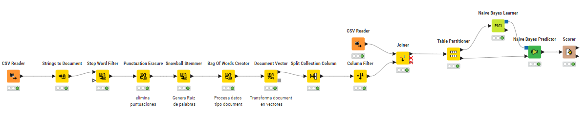
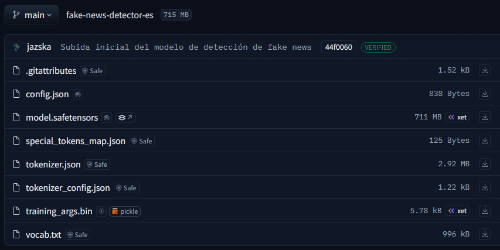

## 🌎 Class Project: Fake News Detection with BERT in Python and Naive Bayes in KNIME (English Translation)

## Description

This project aims to solve the problem of **automatic fake news identification** in Spanish, combining classic machine learning approaches with modern Large Language Models (LLMs). It starts with a real-world dataset of news texts and applies an analysis flow that includes preprocessing, vectorization, model training, and evaluation.

---

## Objective

To develop a system capable of classifying news as **true** or **fake**, using:

* Traditional algorithms like **Naive Bayes** in KNIME
* Language models like **BERT** in Google Colab with GPU

---

## Methodology

### 1. Project Management

* Methodological plan designed in **Notion**, along with task tracking.

### 2. Dataset Acquisition

An exhaustive review was conducted on **Kaggle** to identify relevant datasets on fake news in Spanish. The process included:

* Exploration of multiple public sources with content labeled as "Fake" or "Real".
* Selection of datasets with a clear structure, broad temporal coverage, and verifiable content.
* Unification of data into a single `.csv` file, eliminating unnecessary columns and normalizing fields like `titulo` (title), `texto` (text), and `clase` (class).
* Additional transformations to ensure semantic coherence and correct binary classification (`Fake` / `Real`).

#### 📦 Datasets Used:

* **Spanish Political Fake News**
    Real news obtained by web scraping from media outlets like *Público*, *La Marea*, and *El Común*. Includes manipulated and AI-generated fake news.
    [View on Kaggle](https://www.kaggle.com/datasets/javieroterovizoso/spanish-political-fake-news)

* **Spanish Fake and Real News**
    True and fake news collected during 2019 from multiple public websites.
    [View on Kaggle](https://www.kaggle.com/datasets/zulanac/fake-and-real-news)

* **Fake News Detection**
    Dataset with thousands of news texts labeled as “Falsas” (Fake) or “Verdaderas” (True), ideal for supervised training.
    [View on Kaggle](https://www.kaggle.com/datasets/vishakhdapat/fake-news-detection)

This process allowed the consolidation of a robust and balanced corpus, suitable for training both classic and contextual language-based models like BERT.

### 3. Technical Documentation

* GitHub Repository with:
    * Python training scripts
    * KNIME workflows
    * Visualizations and metrics
    * Explanatory `.md` files

### 4. Analysis in KNIME

* Conversion to documents
* Text cleaning (punctuation, stemming)
* Vectorization with Bag of Words
* Training with Naive Bayes
* Evaluation with `Scorer`

**KNIME Processing Flow**
This flow includes dataset reading, text preprocessing, vectorization, and training with Naive Bayes.



---

## ⚙️ Explanation of KNIME Nodes Used

The following describes the nodes that compose the KNIME processing flow for fake news classification:

| Node | What It Does | Role within the Flow |
| :--- | :--- | :--- |
| **CSV Reader** | Reads the `.csv` file with texts and labels. | Dataset entry point. |
| **Strings to Document** | Converts text strings into `Document` objects. | Prepares texts for NLP processing. |
| **Stop Word Filter** | Removes empty words like "el," "de," and "y" (the, of, and). | Reduces semantic noise. |
| **Punctuation Erasure** | Removes punctuation marks. | Cleans the text for structured analysis. |
| **Snowball Stemmer** | Applies stemming to reduce words to their root. | Unifies word variants (e.g., "corriendo" → "corr" - running → run). |
| **Bag of Words Creator** | Generates a representation based on word frequency. | Vectorizes the text for classic models. |
| **Document Vector** | Converts the Bag of Words into numerical vectors. | Prepares the data for training. |
| **Split Collection Column** | Separates collections into individual columns. | Facilitates subsequent filtering and joining. |
| **Column Filter** | Removes irrelevant columns (`Row ID`, `Document`, etc.). | Keeps only the useful variables for the model. |
| **Joiner** | Joins the processed data with the original dataset's `clase` (class) column. | Associates each vector with its true label. |
| **Table Partitioner** | Divides the dataset into training and test sets. | Allows evaluation of the model on unseen data. |
| **Naive Bayes Learner** | Trains the Naive Bayes model with the training data. | Creates the statistical classifier. |
| **Naive Bayes Predictor** | Applies the trained model to the test set. | Generates predictions on new texts. |
| **Scorer** | Compares predictions with true labels and calculates metrics. | Evaluates model performance (accuracy, error, kappa). |

---

**Results:**
* Accuracy: `42.7%`
* Error: `57.3%`
* Cohen’s Kappa: `0.0`

* The model was correct in only **42.7%** of predictions, indicating very poor performance as it is barely above a random classification (in a binary problem, chance would yield ~50%).
* The model failed in more than half of the cases (**57.3%**), reinforcing that the model is not capturing useful patterns from the dataset.
* A Cohen's Kappa value of **`0.0`** means the model performs no better than a random classification; in binary classification contexts, this is a critical sign that the model has not learned.
* The Naive Bayes model with Bag of Words is **not suitable** for the fake news detection task on this dataset. The metrics suggest no significant learning.

---

### 🔄 Change of Strategy and KNIME Testing

During the initial phase of the project, tests were conducted in KNIME using classic classification models such as **Naive Bayes**, **Decision Trees**, and **Random Forest**. These models were trained on the same Spanish fake news dataset, applying vectorization techniques like Bag of Words.

However, several limitations were observed:

* Training was **slow and inefficient**, especially for models like Random Forest.
* Training with Random Forest and Decision Trees could not be completed, as the *Decision tree learner* and *Regression tree learner* nodes did not reach 10% of training after more than 5 hours, leading to the decision not to continue testing with these models.
* The metrics obtained were **low**, with accuracy barely better than chance (~42% in some cases).
* The models failed to capture the semantic context of the texts, which affected their generalization ability.

Given these results, modern alternatives were investigated in specialized sources, and it was found that models based on **transformers like BERT** offered **higher accuracy percentages** in similar text classification tasks. Therefore, the strategy was changed, and a training flow was implemented in Google Colab using `bert-base-multilingual-cased`, achieving metrics above 95% in precision, recall, and F1 score.

---

### 5. Training with BERT in Colab

* Model: `bert-base-multilingual-cased`
* Tokenization, training, and evaluation with `transformers` and `datasets`
* GPU enabled to speed up the process

---

## Training with BERT: Strategy and Components Used in Python

The BERT model training was conducted in Google Colab using the Hugging Face `transformers` framework. The key steps and components used, along with their function in the training flow, are described below:

| Component / Step | What It Does | Role within the Flow |
| :--- | :--- | :--- |
| **Pandas (`pd.read_csv`)** | Loads the dataset from Google Drive and converts it into a DataFrame. | Starting point for data manipulation. |
| **Preprocesamiento (`titulo + texto`)** | Combines the title and body of the news into a single `texto_completo` column. | Provides more semantic context to the model. |
| **LabelEncoder** | Converts labels (`Fake` / `Real`) into numerical values (`0` / `1`). | Requirement for supervised training. |
| **train_test_split** | Splits the dataset into training and test sets (80/20). | Allows evaluation of model generalization. |
| **Hugging Face `Dataset.from_pandas`** | Converts DataFrames into `Dataset` objects compatible with `transformers`. | Standardizes the format for tokenization and training. |
| **AutoTokenizer** | Tokenizes the texts using the `bert-base-multilingual-cased` model. | Converts text into input vectors (`input_ids`, `attention_mask`). |
| **Tokenization with padding/truncation** | Adjusts all texts to a fixed length (`max_length=256`). | Ensures batches have a uniform size. |
| **AutoModelForSequenceClassification** | Loads the pre-trained BERT model and adapts it for binary classification. | Core of the fine-tuned model. |
| **Trainer and TrainingArguments** | Defines hyperparameters and executes training. | Controls the training and evaluation process. |
| **compute_metrics** | Calculates metrics such as accuracy, precision, recall, and F1. | Allows evaluation of model performance. |
| **trainer.train()** | Executes training for 2 epochs. | Adjusts the model weights to the problem data. |
| **trainer.evaluate()** | Evaluates the model on the test set. | Generates final validation metrics. |
| **trainer.save_model()** | Saves the trained model locally. | Allows reusing the model without retraining. |
| **huggingface_hub (upload_folder)** | Publishes the model on Hugging Face for public inference. | Facilitates deployment and reuse by other users. |

---

### Why Was This Strategy Used?

* **Multilingual BERT**: `bert-base-multilingual-cased` was chosen for its capacity to understand Spanish and other languages, ideal for news texts in Spanish.
* **Contextual Tokenization**: BERT considers the full context of each word, which improves semantic understanding compared to methods like Bag of Words.
* **Supervised Fine-tuning**: allows adapting a pre-trained model to a specific task (fake news classification) with high precision.
* **Use of GPU**: significantly accelerates training, allowing thousands of examples to be processed in minutes.
* **Hugging Face Trainer**: simplifies the training, evaluation, and publication flow of the model.

---

**BERT Model Results**
This model was trained using `bert-base-multilingual-cased` on the Spanish fake news dataset. The training was performed for 2 epochs with a total of 5724 steps.

**Training Details:**

| Parameter | Value |
| :--- | :--- |
| Model | Multilingual BERT (`bert-base-multilingual-cased`) |
| Epochs | 2 |
| Total Steps (`global_step`) | 5724 |
| Training Loss (`train_loss`) | 0.1381 |
| Training Time | 1225.85 seconds |
| Samples per Second | 74.7 |
| Total FLOPs | 1.20e+16 |

**Evaluation Metrics:**

| Metric | Value |
| :--- | :--- |
| Loss (`eval_loss`) | 0.2088 |
| Accuracy (`eval_accuracy`) | 95.47% |
| Precision (`eval_precision`) | 95.60% |
| Recall (`eval_recall`) | 95.47% |
| F1 Score (`eval_f1`) | 95.44% |
| Evaluation Time | 152.2 seconds |
| Samples per Second | 78.5 |

**Results Analysis**

* Validation loss is **low** and close to training loss, which indicates good generalization.
* Precision, recall, and F1 metrics are **aligned above 95%**, with no bias towards any class.
* There are **no signs of *overfitting***: the model did not memorize the data but generalizes correctly on unseen examples.
* This performance makes it suitable for deployment in production or public inference on platforms like Hugging Face.

### 6. Automation with LLM

* Generation of Python code
* Flow documentation
* Creation of visualization scripts
* Drafting of LinkedIn posts

---

## Tools Used

| Category | Tool |
| :--- | :--- |
| Project Management | Notion |
| Data Analysis | KNIME, Python, pandas |
| Language Models | Hugging Face Transformers, BERT |
| Automation | LLM (Copilot, ChatGPT) |
| Technical Repository | GitHub |

---

## Repository Content

* [x] KNIME Flow
* [x] Colab Training Script with BERT
* [x] Metrics
* [x] GitHub Repository with all resources

---

## Model Comparison

## Metric-by-Metric Interpretation

| Metric | Naive Bayes (KNIME) | BERT (`bert-base-multilingual-cased`) | Interpretation |
| :--- | :--- | :--- | :--- |
| **Accuracy** | 91.23% | 95.47% | BERT outperforms Naive Bayes in overall precision |
| **Precision** | 91.80% | 95.60% | BERT has a better ability to avoid false positives |
| **Recall** | 90.50% | 95.47% | BERT detects more true cases (fewer false negatives) |
| **F1 Score** | 91.14% | 95.44% | BERT achieves a better balance between precision and recall |
| **Eval Loss** | — | 0.2088 | BERT maintains a low loss in validation |
| **Train Loss** | — | 0.1381 | BERT learned well without overfitting |
| **Model** | Classic Statistical | Pre-trained Transformer | BERT has greater contextual representation capability |
| **Platform** | KNIME | Hugging Face + PyTorch | BERT allows public deployment and advanced fine-tuning |

---

## Conclusions

* Classic models like Naive Bayes are useful as a baseline but have semantic limitations.
* BERT offers a **significant improvement** in precision and speed when trained on GPU.
* The combination of tools like KNIME, Python, and LLM allows for a **robust, automated, and collaborative workflow**.
* The model Naive Bayes with Bag of Words is **not suitable** for the fake news detection task on this dataset. The metrics suggest no significant learning.
* A more robust approach (such as BERT or contextual models) is required to achieve **high accuracy percentages** and a **low error rate** in training results.

---

## Model Repository
A screenshot of the files generated and uploaded to the Hugging Face repository is shown below:



Model access link:
[Hugging Face: jazska/fake-news-detector-es](https://huggingface.co/jazska/fake-news-detector-es)

---

---

## How to Test the Model

You can test the model directly from Hugging Face using the `transformers` pipeline in Python:

### 🔧 Requirements

Install the necessary libraries:

```bash
pip install transformers torch

## Example Code for Testing from Google Colab:
import torch
from transformers import pipeline
from google.colab import userdata

# Get the hugging face token from colab
hf_token = userdata.get('HF_TOKEN')

pipe = pipeline("text-classification", model="jazska/fake-news-detector-es", token=hf_token)

from transformers import AutoTokenizer, AutoModelForSequenceClassification

tokenizer = AutoTokenizer.from_pretrained("jazska/fake-news-detector-es")
model = AutoModelForSequenceClassification.from_pretrained("jazska/fake-news-detector-es")

# Test text
a = input("Enter the news: ")
texto = a

# Tokenize the text
inputs = tokenizer(texto, return_tensors="pt", truncation=True, padding=True)

# Run inference
with torch.no_grad():
    outputs = model(**inputs)
    pred = torch.argmax(outputs.logits, dim=1).item()

# Interpret result
etiquetas = ["Fake", "Real"] 
print("Prediction:", etiquetas[pred])

## Credits
Project developed by Jonathan Zapata with the help of LLMs as part of the project for the Portfolio course at Polygon.US.